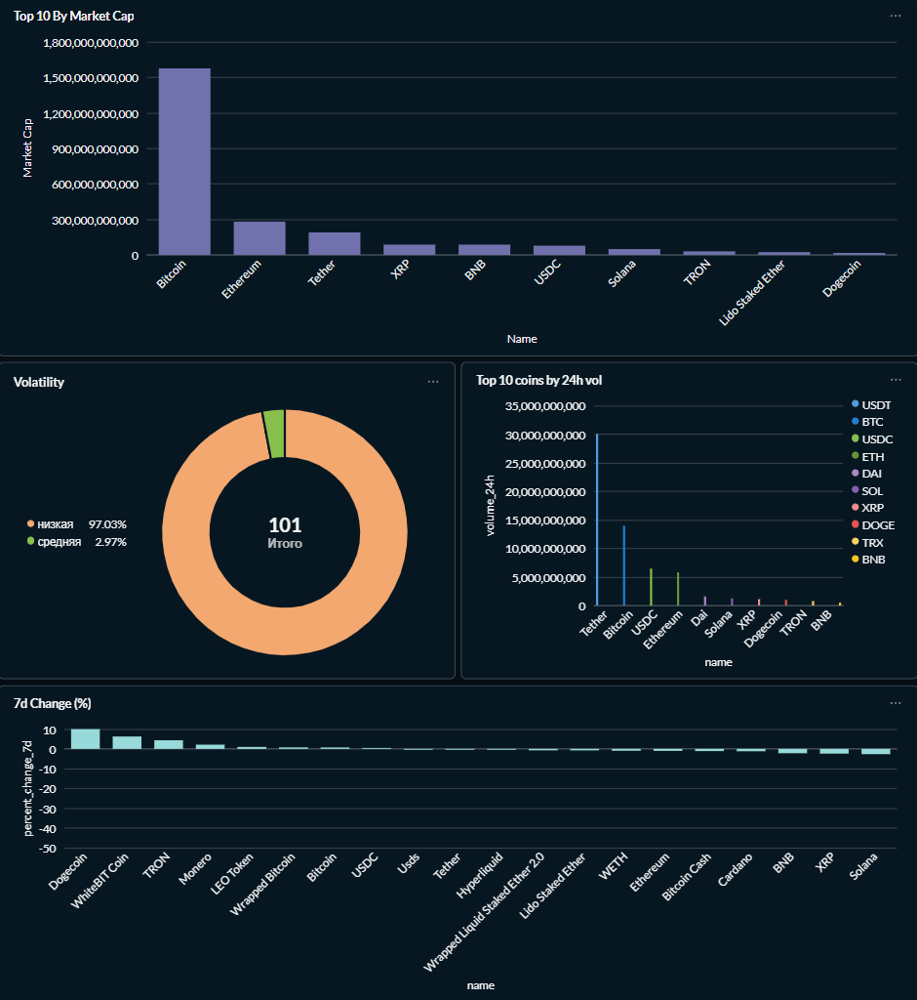

# CoinPaprika ETL

ETL pipeline для загрузки крипто данных с CoinPaprika API.

## Дашборд

## Стек
- Apache Airflow 2.9 — оркестрация
- PostgreSQL 16 — хранилище  
- dbt — трансформации и тесты
- Metabase — визуализация
- Docker + docker-compose — инфраструктура

## Архитектура
CoinPaprika API → Airflow (extract → transform → load) → PostgreSQL → dbt models

## dbt модели
- staging/stg_crypto_tickers — очистка и дедупликация
- marts/top_10_by_market_cap — топ 10 по капитализации  
- marts/closest_to_ath — монеты близкие к историческому максимуму
- marts/volatility — классификация по волатильности

## Запуск
1. docker-compose up -d
2. Добавить переменную DB в Airflow Variables
3. Включить DAG crypto_tickers
4. cd coinpaprika_dbt && dbt run